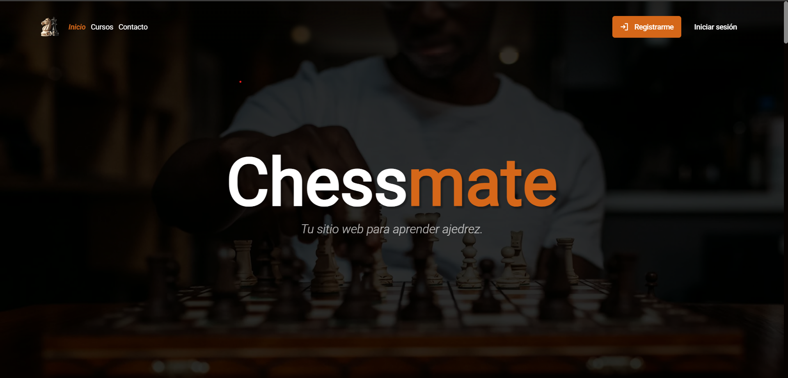
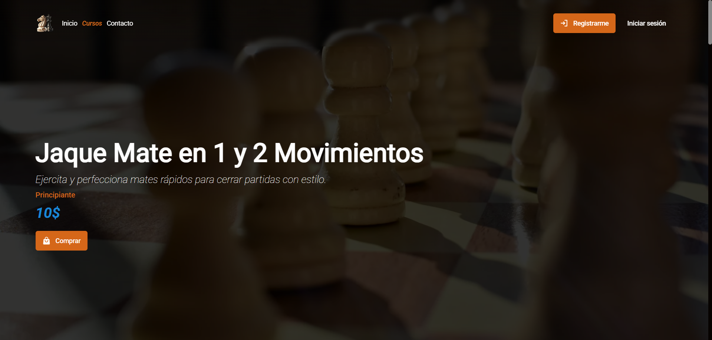
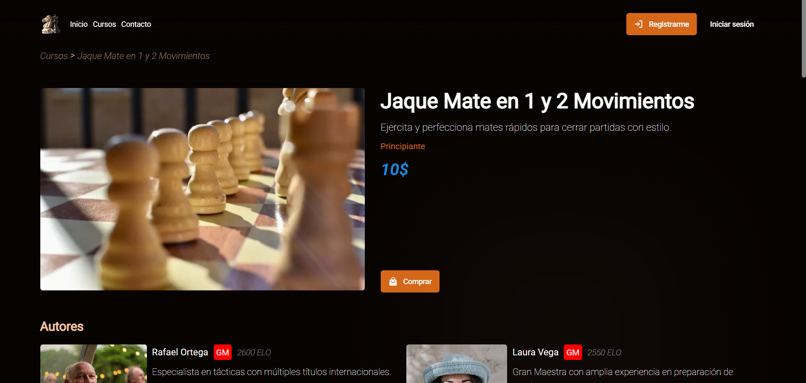
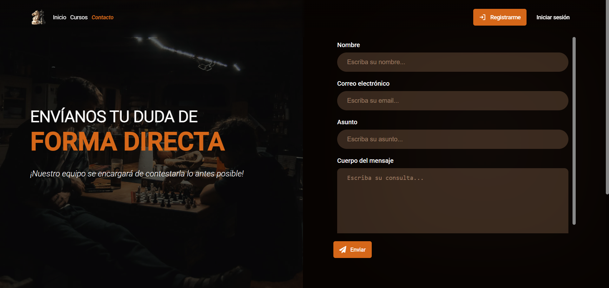
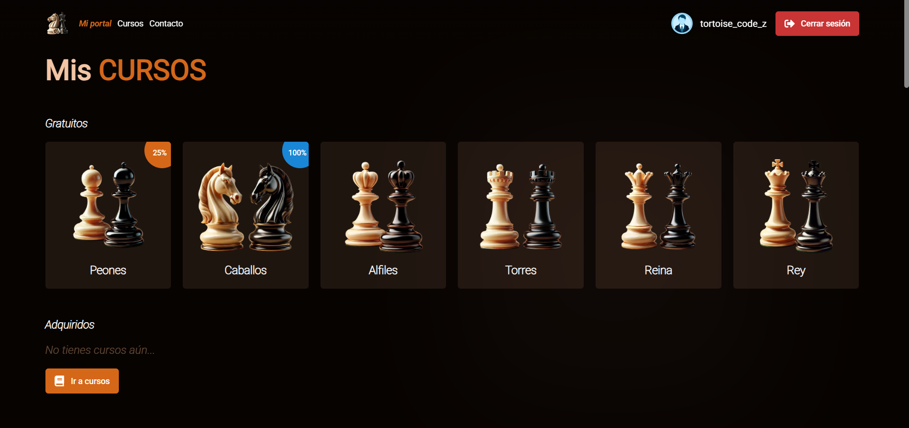
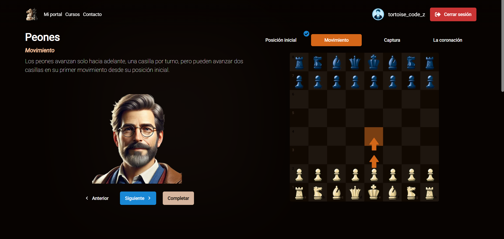
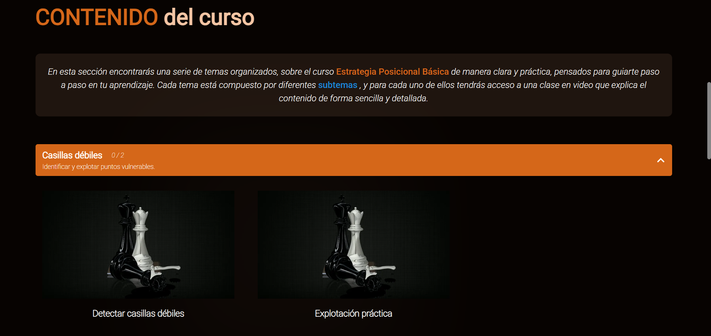
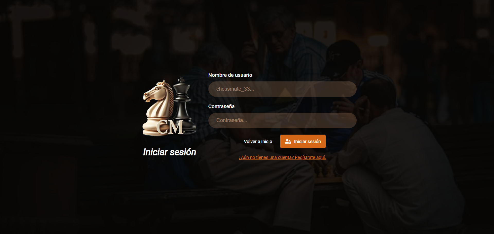

# CHESSMATE - Página de aprendizaje de ajedrez - Víctor Pérez

Aplicación web **frontend moderna** (con backend simulado del lado del cliente) para **cursos online**, totalmente **responsive** y diseñada 100% por mí desde cero en **Figma**.  
Desarrollada con un **stack moderno**, la plataforma contó con el apoyo de la **IA como copiloto**, que me ayudó a generar ideas y resolver dudas durante el desarrollo.

La plataforma permite a los usuarios:

-   Registrarse y gestionar su perfil.
-   Explorar y filtrar cursos disponibles.
-   Acceder a detalles completos de cada curso.
-   Comprar cursos y seguir su progreso en un **dashboard personalizado** y un **classroom virtual**.

Es ideal para **estudiantes** que buscan aprender en línea y para **empresas** que quieran ofrecer **formación digital** a sus equipos.



---

## Tabla de Contenidos 🧭

-   [Demo](#demo)
-   [Características](#características)
-   [Instalación](#instalación)
-   [Uso](#uso)
-   [Estructura del proyecto](#estructura-del-proyecto)
-   [Tecnologías utilizadas](#tecnologías-utilizadas)
-   [Licencia](#licencia)
-   [Contacto](#contacto)

---

## Demo 🚀

-   Live: https://tortoise-code-z.github.io/Chessmate-react/
-   Imágenes del proyecto:  
      
    
    
    
    
    
    
    
    

---

## Características ✨

-   Diseño responsive para móviles y escritorio, ofreciendo buena experiencia en cualquier dispositivo
-   Animaciones suaves que mejoran la interacción del usuario
-   Validación de formularios con Zod para evitar errores en formularios
-   Gestión de estado global con Zustand para mantener datos consistentes entre páginas
-   Simulación de backend con localStorage para pruebas sin servidor real
-   Uso de React-query para manejar asincronías de forma eficiente
-   React-router-dom para una navegación fluida entre secciones
-   React-player para reproducción de videos dentro del classroom
-   Protección de rutas para evitar accesos no permitidos (Dashboard, course-classroom)
-   Feedback al usuario con mensajes de éxito, error y warnings para posibles datos de cursos incompletos

---

## Instalación 🛠️

### Prerrequisitos

-   **Node.js** (versión 18 o superior) — necesario para ejecutar el proyecto y las dependencias de npm.
-   **npm** — gestor de paquetes para instalar dependencias.
-   **Vite** — herramienta de build moderna utilizada para el proyecto (se instala automáticamente con `npm install`).
-   **Git** — si van a clonar el repositorio.

### Pasos de instalación

```bash
# Clonar el repositorio
git clone https://github.com/Tortoise-code-Z/Chessmate-react

# Entrar en el directorio
cd Chessmate-react

# Instalar dependencias
npm install
```

---

## Uso 💻

-   Live: https://tortoise-code-z.github.io/Chessmate-react/

### Casos de uso y comportamiento dinámico ⚙️

La aplicación implementa **comportamientos avanzados de validación y control de flujo**, simulando un backend a través de `localStorage`.  
Esto permite **probar la robustez del frontend** frente a datos faltantes, errores en el ID de curso o rutas protegidas, incluso sin un servidor real.

---

#### 🧠 Lógica de validación principal

1. **Sin `id` o sin `precio` del curso → se bloquea la compra**  
   Por motivos de seguridad y para evitar duplicidades, no se permite ejecutar una compra si el curso no contiene ambos campos.  
   El sistema muestra un mensaje de error claro al usuario.

2. **Sin `id` del curso → acceso bloqueado al classroom**  
   Si el usuario intenta ingresar directamente a la clase sin un identificador válido, la ruta se invalida y se redirige con feedback visual.

3. **Sin `id` o con datos no críticos faltantes (título, descripción, etc.) → feedback visual**  
   En estos casos, se renderizan **cards de curso por defecto** con mensajes informativos, manteniendo la UI estable y consistente.

4. **Protección de rutas con `createHashRouter` y `createBrowserRouter`**  
   En la versión desplegada en GitHub Pages, se utiliza `createHashRouter` porque GitHub solo sirve contenido estático y no permite redirecciones dinámicas a rutas profundas (`/dashboard`, `/classroom`, etc.).
    - Esto se debe a que GitHub Pages **no tiene soporte de servidor para rutas "limpias"**, por lo que al refrescar una ruta interna, el navegador intenta acceder a una URL física (`/dashboard/index.html`), que no existe.
    - El `HashRouter` agrega un `#` en la URL (por ejemplo: `/#/dashboard`) para que la navegación ocurra solo en el cliente y no haya errores 404.
    - Sin embargo, **en desarrollo local**, puedes cambiar a `createBrowserRouter` para probar la navegación real con URLs limpias y proteger rutas como en un entorno de producción con servidor real.

```tsx
// En local (para pruebas)
import { createBrowserRouter } from "react-router-dom";

// En GitHub Pages (por defecto)
import { createHashRouter } from "react-router-dom";
```

---

#### 🧩 Pruebas en `localStorage`

Para probar comportamientos de error o feedback dinámico, puedes ejecutar directamente código en la consola del navegador para manipular los datos simulados de la “base de datos local”.

Asegúrate de tener la aplicación abierta en modo desarrollo (`npm run dev`) o en la demo activa.

##### 🔧 Paso 1: Iniciar sesión o registrarte

Recuerda iniciar sesión en la web (puedes registrarte o usar: usuario -> admin, contraseña -> 1234; si quieres saltarte el paso del registro), para poder estar en el Dashboard y ver toda la lógica de una vez (si estar logueado puedes verlo igual, pero no podrás ver la parte del Dashboard)

##### 🔧 Paso 2: "Compra" varios cursos

Una vez inicias sesión, ve a la page "Cursos" y en la sección "Todos los cursos" compra los 2 primeros.

##### 🔧 Paso 3: Código para ejecutar en la consola del navegador

```js
// Simular base de datos de cursos en localStorage
const bbdd = JSON.parse(localStorage.getItem("DATA_BASE"));

const newCourses = bbdd.courses.map((c) => {
    if (c.courseID === 1) {
        return {
            ...c,
            courseID: null,
        };
    }

    if (c.courseID === 3) {
        return { ...c, price: null };
    }

    if (c.courseID === 2) {
        return {
            ...c,
            content: {
                ...c.content,
                themes: c.content.themes.map((t) => {
                    if (t.id === 1) return { ...t, id: null };
                    if (t.id === 2) {
                        return {
                            ...t,
                            content: t.content.map((c) =>
                                c.id === 1 ? { ...c, id: null } : c
                            ),
                        };
                    }
                    return t;
                }),
            },
            authors: c.authors.map((a, i) => (i === 0 ? null : a)),
        };
    }
    return c;
});

const newDefaultCourses = bbdd.defaultCourses.map((c) => {
    if (c.courseID === 1) {
        return { ...c, courseID: null };
    }

    if (c.courseID === 2) {
        return {
            ...c,
            content: {
                ...c.content,
                themes: c.content.themes.map((t) =>
                    t.id === 1 ? { ...t, description: null } : t
                ),
            },
        };
    }

    return c;
});

const newComments = bbdd.comments.map((c) =>
    c.id === 27 ? { ...c, id: null } : c
);

const newBBDD = {
    ...bbdd,
    courses: newCourses,
    defaultCourses: newDefaultCourses,
    comments: newComments,
};

// Guardar en localStorage
localStorage.setItem("DATA_BASE", JSON.stringify(newBBDD));

// Confirmar que los datos se guardaron correctamente
console.log(
    "Cursos actualizados en localStorage:",
    JSON.parse(localStorage.getItem("DATA_BASE"))
);
```

### 🔧 Paso 4: Refrescar la página y explorar la aplicación

Después de guardar los cambios en `localStorage`, simplemente **refresca la página**.

Podrás observar **mensajes por defecto y feedback visual** en las secciones que lo requieran.

#### Aclaraciones:

-   **Cursos por defecto:**  
    Ingresa a **"Caballos"** para ver el mensaje de feedback en su Classroom.

-   **Cursos obtenidos:**  
    Ingresa a **"Aperturas fundamentales"** (ID: 2, previamente comprado en el Paso 2) para observar:
    -   Mensajes de feedback.
    -   Temas desactivados por seguridad.

> Nota: Para mantener la interfaz limpia, no se han forzado errores en todos los elementos, solo en algunos, con el objetivo de mostrar la funcionalidad de manera clara.

##### 🔍 Qué más puedes probar

-   **Cambiar a `createBrowserRouter` en tu entorno local**  
    → Te permitirá probar protección de rutas y navegación directa (`/dashboard`, `/course/:id`, `/classroom`) como en un entorno de backend real.

---

```bash
# Ejecutar el servidor de desarrollo en local
npm run dev

```

---

## Estructura del proyecto 📁

```plaintext
Chessmate/
│
├── public/
│   └── fonts
├── src/
│   ├── api/
│   ├── assets/
│   ├── components/
│   ├── consts/
│   ├── hooks/
│   ├── pages/
│   ├── schemas/
│   ├── types/
│   ├── utils/
│   └── App.tsx
│   └── index.css
│   └── main.tsx
│
├── package.json
└── README.md
```

---

## Tecnologías utilizadas 🧰

**Diseño:**

-   Figma — diseño de toda la interfaz desde cero, responsive y centrado en UX/UI

**Programación y herramientas:**

-   React + TypeScript — desarrollo del frontend
-   LocalStorage — simulación de backend y almacenamiento de datos del usuario
-   Git — control de versiones
-   GitHub — repositorio público y gestión del proyecto en la nube
-   npm — gestor de paquetes
-   Vite — herramienta de build y servidor de desarrollo
-   Inteligencia Artificial — apoyo como copiloto y generación de datos de la web

**Librerías y utilidades:**

-   React-Query — gestión eficiente de datos asincrónicos
-   React-Router-Dom — navegación y gestión de rutas
-   Zod + Resolvers — validación de formularios
-   React-Hook-Form — manejo de formularios
-   Zustand — gestión de estado global
-   EmblaCarousel — sliders y carrousels
-   React-Player — reproducción de videos

**Estilos:**

-   CSS Modules — estilos modulados para componentes, manteniendo scoped CSS

---

## Licencia 🧾

Este proyecto no tiene licencia formal.

-   **Puedes:**

    -   Ver el código en GitHub.
    -   Clonar el repositorio y ejecutar el proyecto localmente.
    -   Acceder al sitio en vivo y usarlo como referencia o inspiración.
    -   Mostrar capturas o la página en tu portfolio o redes sociales (LinkedIn, Behance, etc.).

-   **No puedes:**
    -   Redistribuir, copiar o incluir el código en otros proyectos sin permiso explícito.
    -   Vender o usar el código con fines comerciales.

---

## Contacto 📬

-   Portfolio: https://tortoise-code-z.github.io/portfolio/
-   Email: victorperez.brmte@passmail.com
-   LinkedIn: www.linkedin.com/in/víctor-pérez-developer
-   GitHub: https://github.com/Tortoise-code-Z
